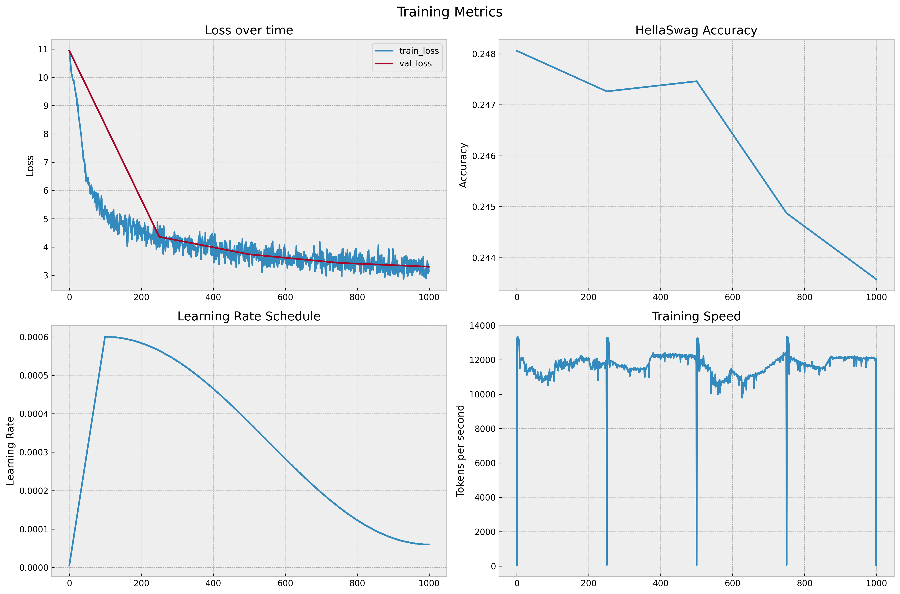

# Train a mini GPT-2 model

A simple implementation of GPT-2 in PyTorch, trained on the `facebook/natural_reasoning` dataset and
evaluated on the HellaSwag dataset. It's a simple toy model that is, mostly, Andrej Karpathy's
[GPT-2](https://github.com/karpathy/build-nanogpt) codebase with some modifications.

## Usage

First, make sure you have `uv` installed—you can
[follow these instructions](https://docs.astral.sh/uv/getting-started/installation/). Then, you can
install the dependencies by running the following command:

```bash
uv sync
```

Before training, you need to set up the training data.

```bash
uv run src/gpt/dataset.py
```

By default, the script expects a dataset in the `natural_reasoning/` directory. If no dataset is
found, the script will generate a dataset using the `facebook/natural_reasoning` dataset from
HuggingFace. Optionally, you can override the dataset path by setting the `DATASET_PATH` environment
variable and setting the `HF_DATASET_NAME` environment variable to the name of the dataset you want
to use.

Once the dataset is set up, you can train the model using the following command:

```bash
uv run src/gpt/train.py
```

During training, the script will save the model checkpoints in the `log/` directory with a name like
`model_00049.pt` where `00049` is the step number. It'll log something like the following to the
console:

```
Configuration from environment:
Model config:
- Block size: 1024
- Vocab size: 50304
- Layers: 4
- Attention heads: 8
- Embedding dim: 768
- Bias: True

Training config:
- Total batch size: 16384
- Micro batch size: 4
- Sequence length: 1024
- Gradient accumulation steps: 4

Training scale:
- Tokens per batch: 16,384
- Total steps: 5,000
- Total tokens: 81,920,000 (0.08B)
- For comparison:
  • GPT-2:     40B tokens
  • GPT-3:    300B tokens
  • LLaMA:  1,000B tokens

Optimization:
- Max learning rate: 0.0006
- Min learning rate: 5.9999999999999995e-05
- Warmup steps: 100
- Weight decay: 0.1
- Device: mps

DDP Configuration:
- DDP rank: 0
- DDP local rank: 0
- DDP world size: 1

total desired batch size: 16384
=> calculated gradient accumulation steps: 4
found 10 shards for split train
found 1 shards for split val

Model Scale Analysis:
Architecture:
- Layers:           4
- Embedding dim:    768
- Attention heads:  8
- Head dim:         96
- Sequence length:  1024
- Vocab size:       50304

Parameter count breakdown:
- Embeddings:      39,419,904 parameters
- Each block:      7,087,872 parameters
  • Attention:     2,362,368
  • MLP:           4,722,432
  • Layer norms:   3,072
- All 4 blocks:   28,351,488 parameters
- Final layer norm: 1,536 parameters

Total model size: 67,772,928 parameters (67.77M)
Memory footprint:
- Model (fp32):        258.5 MB
- Model (fp16/bf16):   129.3 MB
- Optimizer (AdamW):   517.1 MB

Comparison to GPT-2 variants:
- GPT-2 small  ( 124M params): 54.7% the size
- GPT-2 medium ( 350M params): 19.4% the size
- GPT-2 large  ( 774M params): 8.8% the size
- GPT-2 xl     (1558M params): 4.3% the size
num decayed parameter tensors: 18, with 67,731,456 parameters
num non-decayed parameter tensors: 35, with 91,776 parameters
using fused AdamW: False
validation loss: 10.8561
New best model at step 0 with validation loss 10.8561
Evaluating HellaSwag at step 0...
HellaSwag accuracy: 2460/10042=0.2450

step     0 | loss: 10.837882 | lr: 6.0000e-05 | norm: 1.4973 | dt: 259741.99ms | tok/sec: 252.31
...

validation loss: 8.0558
Evaluating HellaSwag at step 49...
HellaSwag accuracy: 2452/10042=0.2442
rank 0 sample 0: Hello, I'm a language model, ...
...
```

As training progresses, the script will also save some metrics to the `log/log.txt` and
`log/metrics.csv` files, which can be used to plot the training and validation loss, as well as the
HellaSwag accuracy. You can see an example in the [`assets/metrics.csv`](assets/metrics.csv) file.

### Environment Variables

The `dataset.py` script uses the following environment variables:

- `DATASET_PATH`: The path to the dataset to train on. Default is `natural_reasoning`.
- `HF_DATASET_NAME`: The name of the dataset to train on. Default is `facebook/natural_reasoning`.
- `SHARD_SIZE`: The number of shards to split the dataset into. Default is `1e8`.

The `train.py` script uses the following environment variables for model configuration:

- `BLOCK_SIZE`: The block size to train the model with. Default is `1024`.
- `VOCAB_SIZE`: The vocabulary size to train the model with. Default is `50304`.
- `N_LAYER`: The number of layers to train the model with. Default is `12`.
- `N_HEAD`: The number of attention heads to train the model with. Default is `12`.
- `N_EMBD`: The embedding dimension to train the model with. Default is `768`.

And the following environment variables for training hyperparameters:

- `TOTAL_BATCH_SIZE`: The total batch size to train the model with. Default is `65536`.
- `BATCH_SIZE`: The micro batch size to train the model with. Default is `8`.
- `SEQ_LENGTH`: The sequence length to train the model with. Default is `256`.
- `MAX_LR`: The maximum learning rate to train the model with (scientific notation). Default is
  `6e-4`.
- `MIN_LR`: The minimum learning rate to train the model with (scientific notation). Default is
  `6e-5`.
- `WARMUP_STEPS`: The number of steps to warm up the learning rate for. Default is `715`.
- `MAX_STEPS`: The number of steps to train the model for. Default is `19073`.
- `SAVE_CHECKPOINT_INTERVAL`: The number of steps to save the model checkpoint. Default is `5000`.
- `WEIGHT_DECAY`: The weight decay to train the model with. Default is `0.1`.

## Evaluation

To evaluate the model on the HellaSwag dataset, run the following command:

```bash
uv run src/eval/evaluate.py --checkpoint <path-to-checkpoint>
```

This will evaluate the model on the HellaSwag dataset and print the results, resembling the
following output:

```
Loading checkpoint from /Users/dtb/exp/gpt/log/model_00049.pt
Initializing model...
Model loaded successfully!
Evaluating on HellaSwag validation set...
10042it [07:37, 21.96it/s]

Overall Results:
Total Accuracy: 0.2490 (2500/10042)

Accuracy by Split Type:
zeroshot: 0.2440
indomain: 0.2539

Detailed Analysis of 5 Random Examples:
...

Detailed results saved to log/eval_results.pt
```

## Testing

Both the `generate.py` and `prompt.py` let you interact with your model. By default, they will use
the latest checkpoint in the `log/` directory, but you can override this by setting the
`TESTING_MODEL_PATH` environment variable to the path of the checkpoint you want to use. To generate
a few examples from the model, run the following command:

```bash
uv run src/eval/generate.py
```

This will generate a few examples from the model and print them to the console, resembling the
following output:

```
Starting model generation demo...
Using device: mps
Loading checkpoint...
Loaded checkpoint from log/model_00049.pt
Initializing model...
Model loaded successfully!

Example 1: Direct text generation
Prompt: What is the relationship between kinetic and potential energy in a
Response: ...

------------------------------------------------------------

Example 2: Question answering
Question: Explain how conservation of energy applies to a pendulum's motion.
Response: Question: Explain how conservation of energy applies to a pendulum's motion.
Answer: ...
```

You can also ask the model a question by running the following command, which will let you interact
with the model in a chat-like interface:

```bash
uv run src/eval/prompt.py
```

This will start a chat-like interface where you can interact with the model:

```
Loading model...
Using device: mps
Loading checkpoint...
Loaded checkpoint from log/model_00049.pt
Initializing model...
Model loaded successfully!

Tiny Physics GPT Chatbot
------------------------
Type 'quit' to exit
Type 'temp X' to change temperature (0.1-2.0)
Type 'tokens X' to change max tokens (1-1000)

You: what is 1+1

Bot: ...
```

Lastly, if you want to peek at the source training data, you can run the following command and alter
the souce code's `PEEK_DATASET_PATH` variable to point to the dataset you want to peek at:

```bash
uv run src/eval/peek_dataset.py
```

This will print the first 1000 tokens of the dataset to the console. It can be helpful in case you
choose a different training dataset (i.e., not `facebook/natural_language`) and need to reformat how
the `train.py` script reads the dataset.

## Plotting

To plot the training and validation loss, run the following command. It reads the `metrics.csv` file
in the `log/` directory, which is created by the `train.py` script.

```bash
uv run src/eval/plot_metrics.py
```

This will generate a file on our `log/` directory called `training_metrics.png`, which will show
four plots from our training runs:

- Training loss over time
- HellaSwag accuracy over time
- Learning rate schedule
- Training speed over time

You can see an example in the [`assets/training_metrics.png`](assets/training_metrics.png)
file—it'll look something like this (which is for a simple 1000 step training run):

[](assets/training_metrics.png)
